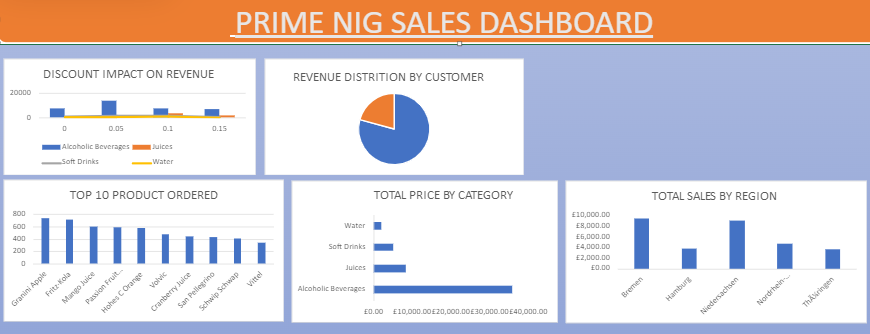

# Project 1

**Title:** [Prime NIG Sales Dashboard](https://github.com/GCFRSAM007/GCFRSAM007.github.io)

**Tools Used:** Microsoft Excel, Pivot-Table

**Project Description:**

**Key findings:**

**Dashboard Overview:**

# Project 1

**Title:** Football player data-SQL data manipulation and interrogation

**SQL Code:** [Football player data code](https://github.com/GCFRSAM007/GCFRSAM007.github.io/blob/main/Data_Record.SQL)

**SQL Skill used:**
Data  retrieval (SELECT): Queried and extracted specific information from the database, 
Data aggregation SUM,COUNT): Calculated tools; such as sales and quantity, and counted records to analyse data. 
Data filtering (WHERE,BETWEEN,IN,AND): Applied filters to select relevant data, including filtering by ranges and lists.
Data source specification (FROM): Specified the table used as a data sources for retrieval.

**Project Description:**

**Technology used:** SQL Server
